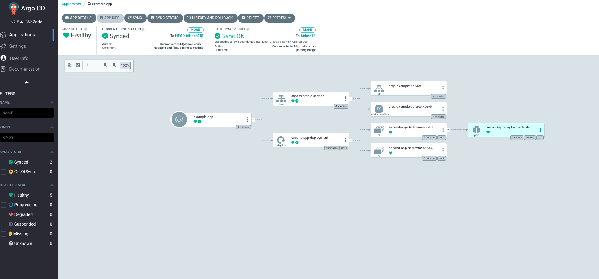

# Argo-cd-examples

- repo used for demonstrating argo cd

- Using Docker Desktop cluster as KIND does not have access to docker hub


## Installing Argo ##

1. create the namespace

```
kubectl create namespace argocd
```

2. apply the install file, this will create all the resources necessary for argo in the argocd namespace

```
kubectl apply -n argocd -f ./argo_templates/install.yaml
```

3. Optional, can port forward the UI to see it if you want

```
kubectl port-forward svc/argocd-server -n argocd 8080:443
```
- user name is admin, would have to get the password via following command

```
kubectl -n argocd get secret argocd-initial-admin-secret -o jsonpath="{.data.password}" | base64 -d; echo
```

4. Create your app in argo by applying an app yaml

**make sure your repo is public or will have to configure your credentials**

```
kubectl apply -n argocd -f ./argo_templates/app.yaml
```

or via cli

```
argocd app create --name example \
--repo https://gitlab.com/cfech44/argo-cd-examples.git \
--dest-server https://kubernetes.default.svc \
--dest-namespace default --path example_project/manifest
```

- Should create the app and the resources and sync with the git repo, can see this on the argocd gui



## Updating App and keeping in sync ##
- once configured argocd should monitor the git repo for updates and sync when necessary


## Kubernetes Commands ##
- see contexts
```
kubectl config get-contexts
```


- change contexts

```
kubectl config use-context docker-desktop
```

- create the resources

```
kubectl apply -f ./example_project/manifest 
```

- delete the resources

```
kubectl delete -f ./example_project/manifest 
```
